<p align="center">
  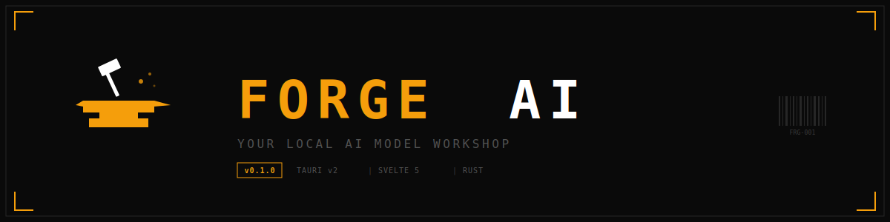
</p>

<h1 align="center">🔨 ForgeAI</h1>

<p align="center">
  <strong>Your local AI model workshop — load, inspect, compress, train, merge, and test models entirely offline.</strong>
</p>

<p align="center">
  
  
  
  
  
</p>

<p align="center">
  No cloud. No accounts. No telemetry. Everything runs on your hardware.
</p>

---

## 📋 Table of Contents

- [Overview](#-overview)
- [Screenshots](#-screenshots)
- [Modules](#-modules)
  - [00 Dashboard](#00--dashboard)
  - [01 Load](#01--load)
  - [02 Inspect](#02--inspect)
  - [03 Compress](#03--compress)
  - [04 Hub](#04--hub)
  - [05 Convert](#05--convert)
  - [06 Training](#06--training)
  - [07 Settings](#07--settings)
  - [08 M-DNA Forge](#08--m-dna-forge)
  - [09 Test](#09--test)
  - [10 DataStudio](#10--datastudio)
- [Supported Formats](#-supported-formats)
- [Tech Stack](#-tech-stack)
- [Architecture](#-architecture)
- [Design System](#-design-system)
- [Getting Started](#-getting-started)
- [System Requirements](#-system-requirements)
- [Project Structure](#-project-structure)
- [License](#-license)

---

## 🔍 Overview

ForgeAI is a **local-first desktop application** for working with AI models — from downloading and inspecting to fine-tuning, merging, and running inference. Built with **Tauri v2**, **SvelteKit 5**, and **Rust**, it provides a native, high-performance experience across Linux, macOS, and Windows.

### ✨ Key Highlights

| Feature | Description |
|---------|-------------|
| 🔒 **Fully Offline** | No internet required after initial setup. Your models stay on your machine. |
| ⚡ **Native Performance** | Rust backend for tensor operations, model parsing, and merge execution |
| 🧠 **12 Merge Methods** | SLERP, TIES, DARE, DeLLa, Frankenmerge, MoE conversion, and more |
| 🎯 **Smart Training** | Capability-targeted fine-tuning — train only the layers that matter |
| 🔬 **Deep Inspection** | 3D architecture visualization, SHA-256 fingerprinting, runtime compatibility |
| 📊 **DataStudio** | Load, analyze, and prepare datasets (JSON, JSONL, CSV, Parquet) with HuggingFace integration |
| 🏗️ **Layer Surgery** | Remove or duplicate layers — pure Rust, no GPU required |
| 🎨 **Industrial Design** | Technical spec sheet aesthetic with monospace fonts and amber accents |

---

## 📸 Screenshots

<details>
<summary><strong>🖥️ Dashboard</strong> — System overview with module status tracking</summary>
<br/>
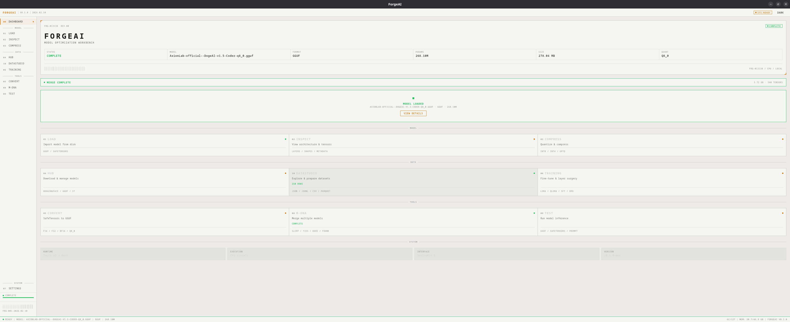
</details>

<details>
<summary><strong>📂 Load</strong> — Import GGUF, SafeTensors, or sharded model folders</summary>
<br/>
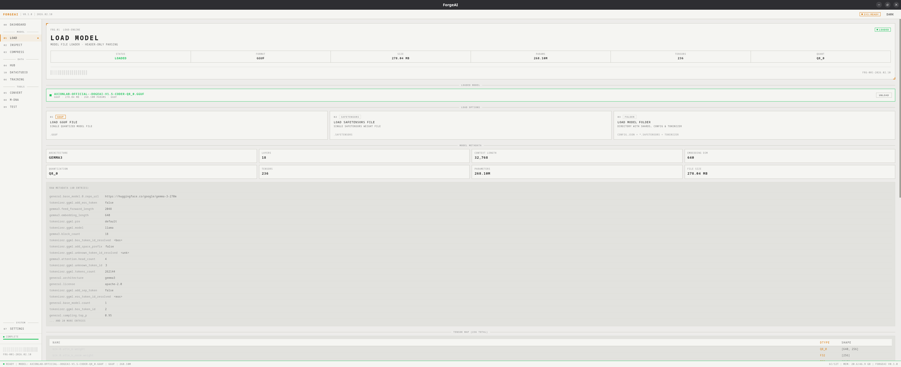
</details>

<details>
<summary><strong>🔬 Inspect</strong> — 3D architecture, memory breakdown, quantization analysis</summary>
<br/>
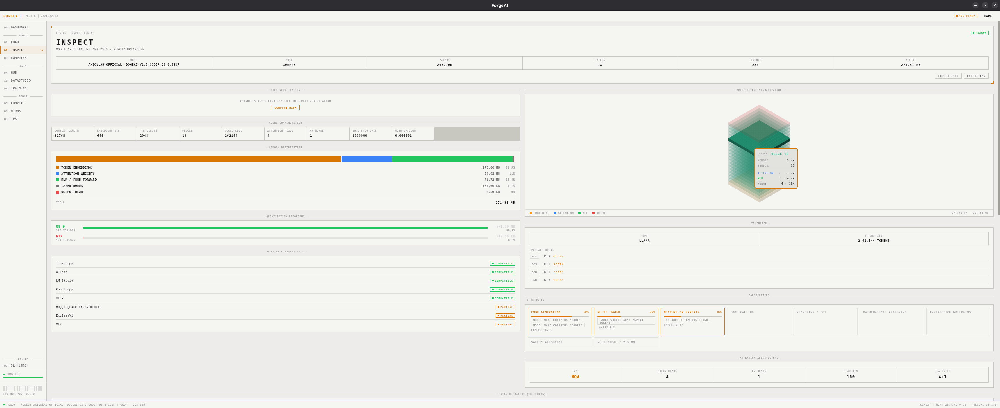
<br/><br/>
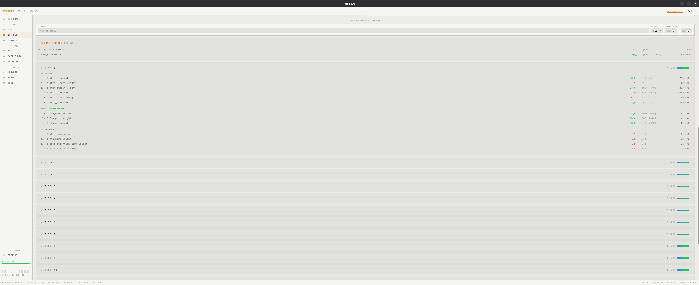
</details>

<details>
<summary><strong>📦 Compress</strong> — Quantize GGUF models (Q2_K → F16)</summary>
<br/>
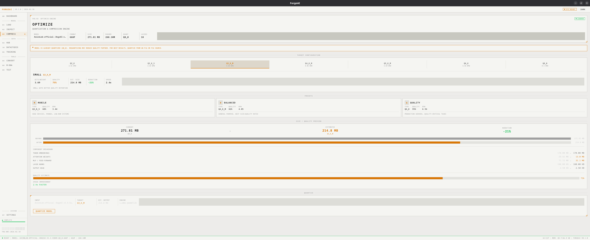
</details>

<details>
<summary><strong>🌐 Hub</strong> — Search HuggingFace & manage local library</summary>
<br/>
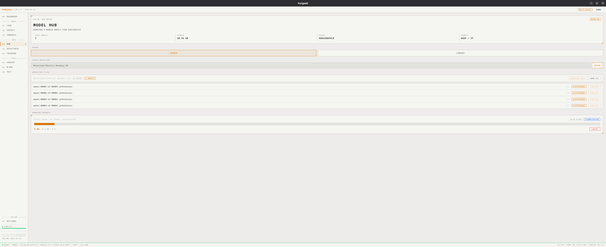
<br/><br/>
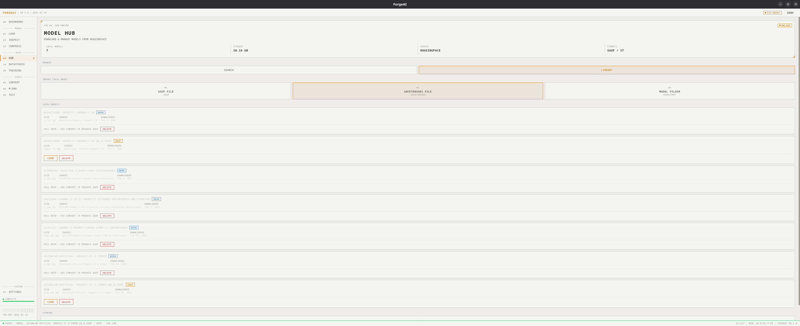
</details>

<details>
<summary><strong>🔄 Convert</strong> — SafeTensors → GGUF conversion</summary>
<br/>
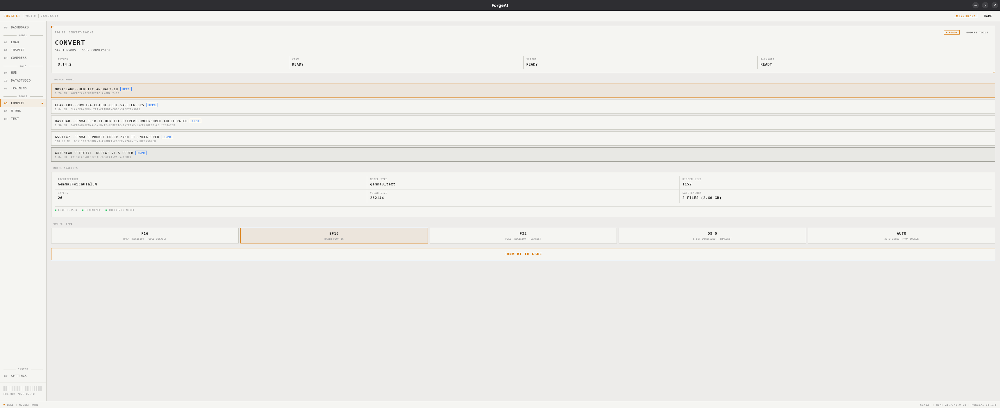
</details>

<details>
<summary><strong>🎯 Training</strong> — Fine-tuning & layer surgery</summary>
<br/>
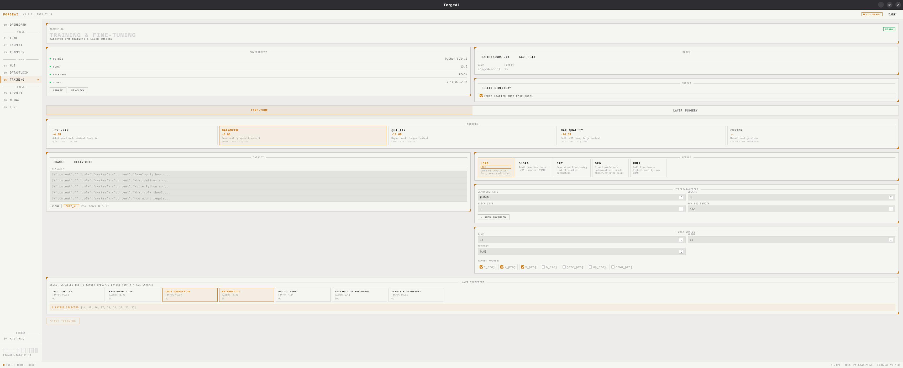
<br/><br/>
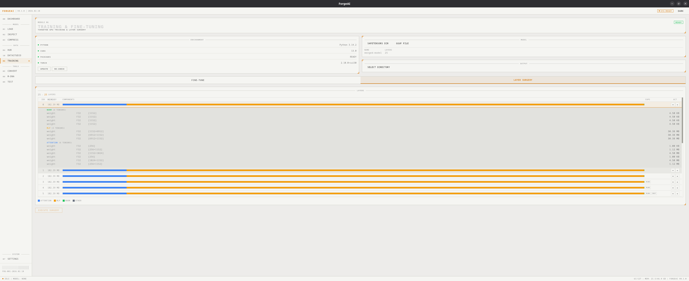
</details>

<details>
<summary><strong>🧬 M-DNA Forge</strong> — Merge models with 12 methods</summary>
<br/>
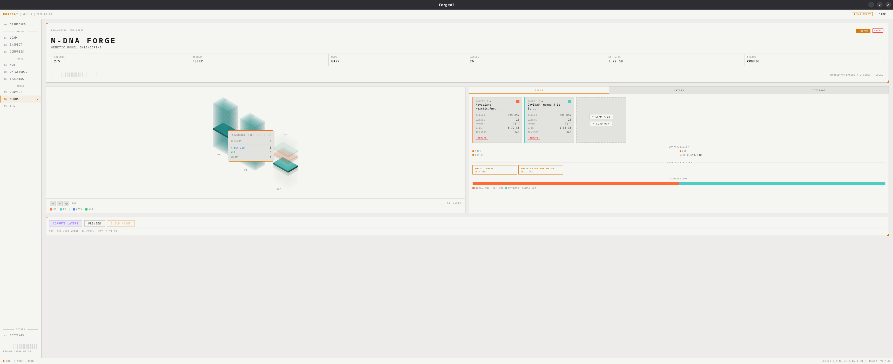
<br/><br/>
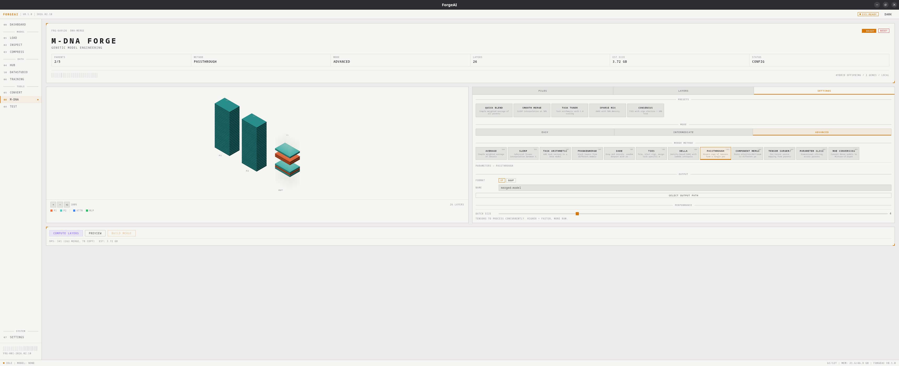
</details>

<details>
<summary><strong>▶️ Test</strong> — Run inference with real-time token streaming</summary>
<br/>
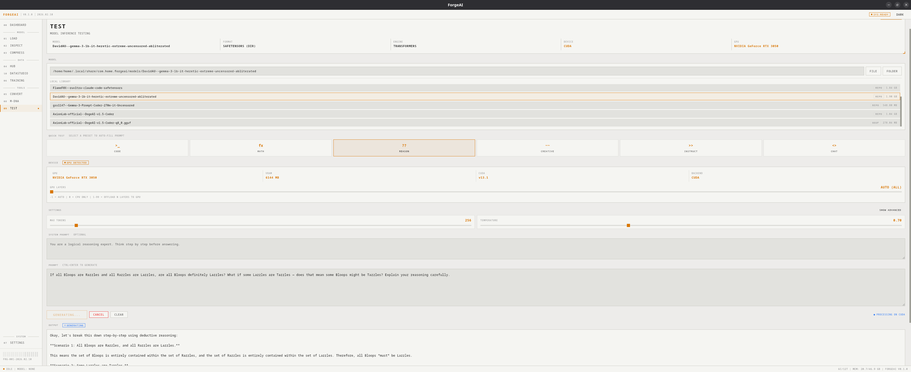
</details>

<details>
<summary><strong>📊 DataStudio</strong> — Explore & prepare datasets</summary>
<br/>
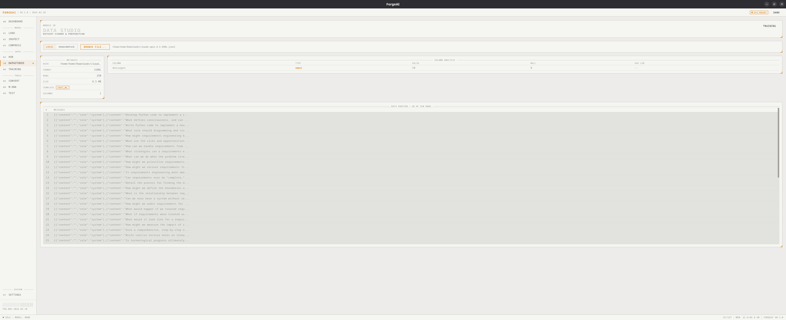
</details>

<details>
<summary><strong>⚙️ Settings</strong> — Environment management & configuration</summary>
<br/>
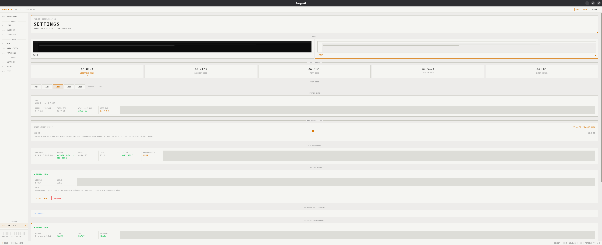
</details>

---

## 🧩 Modules

ForgeAI is organized into **11 modules** grouped into three categories:

| Category | Modules |
|----------|---------|
| **MODEL** | Load, Inspect, Compress |
| **DATA** | Hub, DataStudio, Training |
| **TOOLS** | Convert, M-DNA Forge, Test |
| **SYSTEM** | Dashboard, Settings |

---

### 00 · Dashboard

> **System command center** — real-time overview of all modules and active tasks.

The dashboard provides a bird's-eye view of your entire workflow:

- **System Status Banner** — shows current state (IDLE / LOADING / TRAINING / MERGING / COMPLETE)
- **Loaded Model Specs** — file name, format, parameters, size, quantization level
- **Module Cards** — all 11 modules organized in MODEL / DATA / TOOLS groups
- **Live Activity Badges** — real-time progress on each module (e.g., "TRAINING 45%", "MERGING 72%")
- **Quick Navigation** — click any module card to jump directly to it

Each module card shows:
- Module code and name
- Short description of its function
- Supported formats/operations
- Current status (ready / awaiting model / active task)

---

### 01 · Load

> **Model import** — load GGUF files, SafeTensors files, or sharded HuggingFace model directories.

| Input Type | How |
|-----------|-----|
| **GGUF file** | Browse for a single `.gguf` file |
| **SafeTensors file** | Browse for a single `.safetensors` file |
| **SafeTensors directory** | Select a folder containing sharded SafeTensors + config files |

Once loaded, the model is available globally across all modules — Inspect, Compress, Training, Test, and more. The status bar at the bottom shows the loaded model's name, format, and parameter count at all times.

**Displayed Info:**
- File name and full path
- File size
- Format (GGUF / SafeTensors)
- Architecture (e.g., LlamaForCausalLM)
- Parameter count
- Quantization type (for GGUF)
- Shard count (for multi-file models)

---

### 02 · Inspect

> **Deep model analysis** — architecture visualization, memory layout, capability detection, runtime compatibility.

Inspect provides a comprehensive X-ray of any loaded model.

#### 🏗️ 3D Isometric Architecture Visualization
An interactive isometric tower view of the model's layer structure. Hover over layers to see details. Visual representation of attention heads, MLP blocks, and normalization components.

#### 📊 Memory Distribution
Six-component breakdown showing how memory is allocated:

| Component | What |
|-----------|------|
| Embeddings | Token embedding weights |
| Attention | Q/K/V/O projection matrices |
| MLP | Gate, up, and down projections |
| Norms | RMSNorm / LayerNorm weights |
| Output | Language model head |
| Other | Miscellaneous tensors |

Each component shows exact byte count and percentage with visual bars.

#### 🔢 Quantization Breakdown
Per-dtype analysis of all tensors — shows distribution across F32, F16, BF16, Q8_0, Q4_K_M, etc. with visual bar chart.

#### 🖥️ Runtime Compatibility Matrix
Checks support across 8 popular inference runtimes:

| Runtime | Checks |
|---------|--------|
| llama.cpp | Format, quantization compatibility |
| Ollama | Format support |
| LM Studio | Format and architecture support |
| GPT4All | Format support |
| Kobold.cpp | GGUF compatibility |
| Jan | Format support |
| LocalAI | Format support |
| text-generation-webui | Format and architecture |

#### 🧠 Capability Detection
Analyzes model architecture to detect 7 capabilities with confidence scores:

| Capability | What It Detects |
|-----------|----------------|
| 🔧 Tool Calling | API/function calling ability |
| 🧠 Reasoning | Chain-of-thought reasoning |
| 💻 Code | Code generation/understanding |
| 🔢 Mathematics | Mathematical reasoning |
| 🌍 Multilingual | Multi-language support |
| 📋 Instruction | Instruction following |
| 🛡️ Safety | Safety/alignment layers |

#### 🔐 SHA-256 Fingerprint
Compute and verify file integrity with cryptographic hashing.

#### 📋 Additional Panels
- **Configuration** — all model hyperparameters (hidden size, head count, layers, vocab size, etc.)
- **Attention Architecture** — GQA visualization with query/key-value head ratios
- **Tokenizer Info** — special tokens (BOS, EOS, PAD, UNK) and vocabulary size
- **Layer Hierarchy** — expandable block structure with nested components
- **Tensor Browser** — searchable, filterable list of all tensors with name, shape, dtype, and size
- **Export** — JSON or CSV export of the full inspection report

---

### 03 · Compress

> **GGUF quantization** — reduce model size while preserving quality.

Quantize GGUF models across 7 levels with real-time size and quality estimation.

#### Quantization Levels

| Level | Bits/Weight | Quality | Speed | Use Case |
|-------|:-----------:|:-------:|:-----:|----------|
| **Q2_K** | 2.6 | ⭐ | ⚡⚡⚡⚡⚡ | Maximum compression, minimal quality |
| **Q3_K_M** | 3.4 | ⭐⭐ | ⚡⚡⚡⚡ | Mobile / Edge devices |
| **Q4_K_M** | 4.5 | ⭐⭐⭐ | ⚡⚡⚡ | Best balance of size and quality |
| **Q5_K_M** | 5.5 | ⭐⭐⭐⭐ | ⚡⚡ | High quality with good compression |
| **Q6_K** | 6.5 | ⭐⭐⭐⭐ | ⚡⚡ | Near-original quality |
| **Q8_0** | 8.0 | ⭐⭐⭐⭐⭐ | ⚡ | Minimal quality loss |
| **F16** | 16.0 | ⭐⭐⭐⭐⭐ | — | Full precision (half-float) |

#### Quick Presets

| Preset | Level | Target |
|--------|-------|--------|
| 📱 **MOBILE** | Q3_K_M | Small devices, maximum compression |
| ⚖️ **BALANCED** | Q4_K_M | Best all-around choice |
| 🎯 **QUALITY** | Q6_K | Quality-first with good compression |

#### Features
- **Before/After Comparison** — estimated file size and memory reduction
- **Component Breakdown** — memory per component type at the target quantization
- **Requantization Warning** — alerts when quantizing an already-quantized model (quality loss)
- **Progress Tracking** — real-time quantization progress with ETA
- Uses **llama.cpp** under the hood (auto-downloaded via Settings)

---

### 04 · Hub

> **Model discovery & management** — search HuggingFace, download models, manage your local library.

#### 🔍 Search Mode
- Enter any HuggingFace repository ID (e.g., `TheBloke/Llama-2-7B-GGUF`)
- View all files in the repository with size, format, and download buttons
- Download individual files or entire repositories
- Real-time download progress with speed and percentage
- Cancel downloads at any time

#### 📚 Library Mode
- Browse all locally downloaded models
- View metadata: file name, size, format, source repository, download date
- Total storage tracking across all models
- Delete models to free space
- Import existing local models/folders into the library

---

### 05 · Convert

> **Format conversion** — transform SafeTensors models into GGUF format for efficient inference.

#### Workflow
1. **Select Source** — pick a SafeTensors model directory (or select from Hub downloads)
2. **Auto-Detect** — ForgeAI analyzes the model architecture, layer count, vocab size, hidden dimensions
3. **Choose Output Type** — select conversion precision
4. **Convert** — watch progress stage-by-stage

#### Output Types

| Type | Description | Use Case |
|------|-------------|----------|
| **F16** | Half-precision float | Good balance of size and precision |
| **BF16** | Brain floating point | Better for models trained in BF16 |
| **F32** | Full precision | Maximum accuracy, largest size |
| **Q8_0** | 8-bit quantized | Smallest output, ready for inference |
| **AUTO** | Automatic | Uses the model's native precision |

#### Auto-Detection
The converter automatically identifies:
- `config.json` — model architecture and hyperparameters
- `tokenizer.json` / `tokenizer.model` — tokenizer files
- `tokenizer_config.json` — tokenizer configuration
- `*.safetensors` — all sharded weight files

Uses a **separate Python environment** (managed via Settings) with the HuggingFace conversion scripts.

---

### 06 · Training

> **Fine-tuning & layer surgery** — adapt models with GPU-accelerated training or perform pure-Rust tensor operations.

Training has two modes: **Fine-Tune** and **Layer Surgery**.

#### 🎯 Fine-Tune Mode

##### Training Methods

| Method | Description | VRAM Needed |
|--------|-------------|:-----------:|
| **LoRA** | Low-Rank Adaptation — efficient adapter training | 6–12 GB |
| **QLoRA** | Quantized LoRA — 4-bit base model with LoRA adapters | 4–8 GB |
| **SFT** | Supervised Fine-Tuning — standard training on datasets | 8–24 GB |
| **DPO** | Direct Preference Optimization — learn from chosen/rejected pairs | 8–24 GB |
| **Full** | Full parameter update — maximum quality, highest requirements | 16–48 GB |

##### Training Presets

| Preset | VRAM | Method | Rank | Seq Length |
|--------|:----:|--------|:----:|:----------:|
| 🔋 **LOW VRAM** | ~4 GB | QLoRA | 8 | 256 |
| ⚖️ **BALANCED** | ~6 GB | QLoRA | 16 | 512 |
| 🎯 **QUALITY** | ~12 GB | LoRA | 32 | 1024 |
| 🏆 **MAX QUALITY** | ~24 GB | LoRA | 64 | 2048 |

##### Hyperparameters
Full control over all training parameters:
- Learning rate, epochs, batch size
- Gradient accumulation steps
- Max sequence length
- Warmup steps, weight decay
- Save steps interval
- LoRA rank, alpha, dropout
- Quantization bits (4/8 for QLoRA)
- DPO beta

##### 🧠 Capability-Targeted Layer Selection
Instead of fine-tuning the entire model, target specific capabilities:

| Capability | Affected Layers | What It Trains |
|-----------|:--------------:|---------------|
| 🔧 Tool Calling | Upper-mid | Teach the model to use tools/APIs |
| 🧠 Reasoning / CoT | Mid-upper | Improve chain-of-thought reasoning |
| 💻 Code Generation | Upper-mid | Enhance code writing ability |
| 🔢 Mathematics | Mid | Improve mathematical reasoning |
| 🌍 Multilingual | Early-mid | Add or improve language support |
| 📋 Instruction Following | Mid | Better adherence to instructions |
| 🛡️ Safety & Alignment | Final | Adjust safety/alignment behavior |

##### Target Module Detection
Auto-detects available LoRA target modules from the model architecture:
`q_proj` · `k_proj` · `v_proj` · `o_proj` · `gate_proj` · `up_proj` · `down_proj`

##### Dataset Support
- **Auto-detection** of dataset templates: Alpaca, ShareGPT, ChatML, DPO pairs, Text, Prompt/Completion
- **Supported formats**: JSON, JSONL, CSV, Parquet
- **Preview**: View dataset rows and column structure before training

##### Live Training Dashboard
- Real-time epoch/step/loss/learning rate monitoring
- Step-by-step loss history chart
- GPU memory (VRAM) usage tracking
- ETA and time remaining
- Option to merge adapter back into base model after training

#### 🔪 Layer Surgery Mode

Pure Rust tensor operations — **no Python or GPU required**.

| Operation | Description |
|-----------|-------------|
| **Remove Layers** | Select and strip unnecessary layers to reduce model size |
| **Duplicate Layers** | Clone layers at specific positions to increase depth |

##### Features
- **Rich Layer Table** — memory breakdown per layer with component bars (attention / MLP / norm %)
- **Tensor-Level Inspection** — expand any layer to see every tensor's dtype, shape, and memory
- **Surgery Preview** — shows final layer count before execution
- **Format Support** — works with both SafeTensors directories and GGUF files
- **Auto-Update** — automatically updates `config.json` / GGUF metadata with new layer counts

---

### 07 · Settings

> **Application configuration** — theme, fonts, GPU detection, and environment management.

#### 🎨 Appearance
- **Theme Toggle** — Dark mode (default) / Light mode
- **Font Family** — choose from system monospace fonts (JetBrains Mono preferred)
- **Font Size** — adjustable base font size

#### 🖥️ GPU Detection
- Automatic CUDA/GPU detection
- Displays GPU name, VRAM, driver version

#### 🔧 Environment Management
Manage all three tool environments from one place:

| Environment | What It Manages |
|-------------|----------------|
| **llama.cpp** | GGUF inference & quantization binary — download, update, or remove |
| **Training** | Python venv with PyTorch, Transformers, PEFT, TRL, BitsAndBytes — setup, view packages, clean |
| **Convert** | Python venv with HuggingFace conversion scripts — setup, view packages, clean |

Each environment shows:
- Installation status (installed / partial / not installed)
- Python version and venv path
- Installed packages list
- CUDA availability
- **Clean/Delete** button to remove the environment and start fresh

---

### 08 · M-DNA Forge

> **Model merging** — combine 2–5 parent models into hybrid offspring with full control over strategy and layer composition.

#### 🧬 12 Merge Methods

| Method | Difficulty | Description |
|--------|:----------:|-------------|
| **Average** | Easy | Simple weighted average of tensors |
| **SLERP** | Easy | Spherical linear interpolation — best for 2-model merges |
| **Passthrough** | Easy | Direct copy from a single parent |
| **Task Arithmetic** | Intermediate | Add task vectors from multiple finetunes to a base model |
| **Frankenmerge** | Intermediate | Cherry-pick specific layers from specific parents |
| **DARE** | Intermediate | Drop and rescale — prunes delta parameters with random dropout |
| **TIES** | Intermediate | Trim, elect sign, merge — resolves task vector interference |
| **DeLLa** | Advanced | Density-based layer-level adaptive merging with lambda |
| **Component Merge** | Advanced | Route attention/MLP/norm components to different parents |
| **Tensor Surgery** | Advanced | Per-tensor source mapping from any parent |
| **Parameter Slice** | Advanced | Dimensional slicing across parent tensors |
| **MoE Conversion** | Advanced | Convert dense models into Mixture-of-Experts architecture |

#### ⚡ Quick Presets

| Preset | Method | Key Params | Best For |
|--------|--------|-----------|----------|
| 🎯 **Quick Blend** | Average | — | Simple, fast merging |
| 🌀 **Smooth Merge** | SLERP | t = 0.5 | Balanced interpolation |
| 🔧 **Task Tuner** | Task Arithmetic | scaling = 1.0 | Adding capabilities |
| 🎲 **Sparse Mix** | DARE | density = 0.5 | Efficient delta merging |
| 🗳️ **Consensus** | TIES | trim = 0.2 | Conflict resolution |

#### 🏗️ 3D Isometric Visualization
Interactive tower view showing all parent models and the resulting offspring. Each layer is color-coded by its source parent. Pan, zoom, and hover for details.

#### 🎛️ Three Difficulty Modes

| Mode | Control Level | Best For |
|------|:------------:|---------|
| **Easy** | Basic settings only | First-time users |
| **Intermediate** | Method params + layer assignment | Most merges |
| **Advanced** | Full tensor/component control | Expert users |

#### Features
- **Layer Assignment** — manually assign each layer to a parent, or use auto-assign (Split / Interleave)
- **Capability Detection** — detect and filter layers by capability (reasoning, code, math, etc.)
- **Layer Analysis** — specialization profiling (Syntactic / Semantic / Reasoning)
- **Compatibility Check** — validates architecture and dimension compatibility across parents
- **Batch Size Control** — 1–16 tensors processed concurrently (higher = faster, more RAM)
- **Composition Stats** — real-time parent weight and layer distribution
- **Output Formats** — SafeTensors (HF-compatible directory) or GGUF (with embedded tokenizer)
- **Background Execution** — navigate freely while the merge runs
- **Progress Tracking** — real-time progress in the sidebar and status bar

---

### 09 · Test

> **Model inference** — run prompts through your models with real-time token streaming.

Supports both **GGUF** (via llama.cpp) and **SafeTensors** (via HuggingFace Transformers) models.

#### 🧪 Quick Test Presets

| Preset | Prompt Theme | Tests |
|--------|-------------|-------|
| 💻 **CODE** | FizzBuzz in Python | Code generation ability |
| 🔢 **MATH** | Word problem solving | Mathematical reasoning |
| 🧠 **REASON** | Logic puzzle | Logical deduction |
| 🎨 **CREATIVE** | Story writing | Creative writing |
| 📋 **INSTRUCT** | Step-by-step tasks | Instruction following |
| 💬 **CHAT** | Conversational | General chat ability |

#### Generation Settings

| Parameter | Range | Default | Description |
|-----------|:-----:|:-------:|-------------|
| Max Tokens | 1–8192 | 256 | Maximum output length |
| Temperature | 0.0–2.0 | 0.7 | Randomness (0 = deterministic) |
| Top-p | 0.0–1.0 | 0.9 | Nucleus sampling threshold |
| Top-k | 1–100 | 40 | Top-k token sampling |
| Repeat Penalty | 1.0–2.0 | 1.1 | Repetition suppression |
| Context Size | 512–32768 | 2048 | Context window size |
| GPU Layers | -1 to 99 | -1 | Layer offloading (-1=auto, 0=CPU) |

#### Features
- **System Prompt** — custom system message for the model
- **Local Library Integration** — select models from your Hub downloads
- **Real-Time Streaming** — tokens appear as they're generated
- **Performance Metrics** — tokens/sec, total generation time, device used (CPU/GPU)
- **Cancel** — stop generation mid-stream at any time

---

### 10 · DataStudio

> **Dataset explorer** — load, analyze, and prepare datasets from local files or HuggingFace.

#### 📁 Local Mode
- Browse and load dataset files from disk
- Supports **JSON**, **JSONL**, **CSV**, and **Parquet** formats

#### 🌐 HuggingFace Mode
- Search datasets by repository ID (e.g., `tatsu-lab/alpaca`)
- View available files with format badges and file sizes
- Download individual files with real-time progress tracking
- Auto-loads the dataset after download completes

#### 📊 Analysis Features

| Feature | Description |
|---------|-------------|
| **Metadata** | File path, format, row count, file size, column count |
| **Template Detection** | Auto-detects dataset template (Alpaca, ShareGPT, ChatML, DPO, Text, etc.) |
| **Column Analysis** | Per-column dtype, valid count, null count, average string length |
| **Null Detection** | Highlights columns with null values for data quality checks |
| **Data Preview** | Scrollable table showing first N rows with cell truncation |
| **Parquet Support** | Native Rust Parquet reader using Apache Arrow |

---

## 📐 Supported Formats

### Model Formats

| Format | Load | Inspect | Compress | Convert | Merge | Train | Surgery | Test |
|--------|:----:|:-------:|:--------:|:-------:|:-----:|:-----:|:-------:|:----:|
| **GGUF** | ✅ | ✅ | ✅ | output | ✅ | ✅ | ✅ | ✅ |
| **SafeTensors** | ✅ | ✅ | — | input | ✅ | ✅ | ✅ | ✅ |
| **Sharded Folders** | ✅ | ✅ | — | input | ✅ | ✅ | ✅ | ✅ |

### Dataset Formats

| Format | DataStudio | Training | HuggingFace |
|--------|:----------:|:--------:|:-----------:|
| **JSON** | ✅ | ✅ | ✅ |
| **JSONL** | ✅ | ✅ | ✅ |
| **CSV** | ✅ | ✅ | ✅ |
| **Parquet** | ✅ | ✅ | ✅ |

---

## ⚙️ Tech Stack

| Layer | Technology | Role |
|-------|-----------|------|
| 🖥️ **Shell** | [Tauri v2](https://v2.tauri.app/) | Native desktop window (Linux, macOS, Windows) |
| 🎨 **Frontend** | [SvelteKit 5](https://svelte.dev/) (Svelte 5 runes) | Reactive UI with `$state`, `$derived`, `$effect`, `$props` |
| ⚙️ **Backend** | [Rust](https://www.rust-lang.org/) (2021 edition) | Model parsing, tensor operations, merge execution, layer surgery |
| 🧮 **Tensors** | [Candle](https://github.com/huggingface/candle) | Rust ML framework for tensor math (SLERP, TIES, DARE, etc.) |
| 📦 **GGUF** | [llama.cpp](https://github.com/ggerganov/llama.cpp) | Quantization and GGUF inference with GPU support |
| 🎯 **Training** | [PyTorch](https://pytorch.org/) + [PEFT](https://github.com/huggingface/peft) + [TRL](https://github.com/huggingface/trl) | GPU fine-tuning via managed Python subprocess |
| 🔬 **Inference** | [HuggingFace Transformers](https://github.com/huggingface/transformers) | SafeTensors inference via Python |
| 🌐 **Hub** | [HuggingFace API](https://huggingface.co/) | Model and dataset discovery/download |
| 📊 **Parquet** | [Apache Arrow](https://arrow.apache.org/) + [Parquet](https://parquet.apache.org/) | Native Rust dataset parsing |
| ⚡ **Async** | [Tokio](https://tokio.rs/) | Non-blocking task execution |
| 🔄 **Serialization** | [Serde](https://serde.rs/) | Rust ↔ Frontend data exchange |
| 📎 **Dialogs** | [tauri-plugin-dialog](https://github.com/nicovank/tauri-plugin-dialog) | Native file picker dialogs |

---

## 🏛️ Architecture

```
┌─────────────────────────────────────────────────────────────┐
│                     SvelteKit 5 Frontend                    │
│                                                             │
│  ┌──────────┐ ┌──────────┐ ┌──────────┐ ┌──────────┐       │
│  │Dashboard │ │  Load    │ │ Inspect  │ │ Compress │       │
│  └──────────┘ └──────────┘ └──────────┘ └──────────┘       │
│  ┌──────────┐ ┌──────────┐ ┌──────────┐ ┌──────────┐       │
│  │   Hub    │ │DataStudio│ │ Training │ │ Convert  │       │
│  └──────────┘ └──────────┘ └──────────┘ └──────────┘       │
│  ┌──────────┐ ┌──────────┐ ┌──────────┐                    │
│  │  M-DNA   │ │   Test   │ │ Settings │                    │
│  └──────────┘ └──────────┘ └──────────┘                    │
│                                                             │
│  Svelte 5 Stores: model · dna · training · hub · test ·    │
│                   convert · datastudio · theme              │
└─────────────────────┬───────────────────────────────────────┘
                      │  Tauri IPC (invoke / events)
┌─────────────────────▼───────────────────────────────────────┐
│                      Rust Backend                           │
│                                                             │
│  ┌───────────────┐  ┌─────────────────────────────────┐     │
│  │ Model Parser  │  │ Merge Engine (M-DNA)            │     │
│  │ ───────────── │  │ ──────────────────────────────  │     │
│  │ GGUF headers  │  │ 12 methods (SLERP, TIES, DARE, │     │
│  │ SafeTensors   │  │ DeLLa, Frankenmerge, MoE, ...)  │     │
│  │ Multi-shard   │  │ Candle tensor operations        │     │
│  │ Tensor index  │  │ Layer profiler & analyzer       │     │
│  └───────────────┘  └─────────────────────────────────┘     │
│  ┌───────────────┐  ┌─────────────────────────────────┐     │
│  │ Quantizer     │  │ Training Engine                 │     │
│  │ ───────────── │  │ ──────────────────────────────  │     │
│  │ llama.cpp     │  │ Python subprocess (venv)        │     │
│  │ 7 quant types │  │ PyTorch + PEFT + TRL            │     │
│  │ GPU support   │  │ CUDA auto-detection             │     │
│  └───────────────┘  └─────────────────────────────────┘     │
│  ┌───────────────┐  ┌─────────────────────────────────┐     │
│  │ HF Hub Client │  │ Layer Surgery                   │     │
│  │ ───────────── │  │ ──────────────────────────────  │     │
│  │ Model search  │  │ Pure Rust tensor remapping      │     │
│  │ Dataset fetch │  │ Remove / duplicate layers       │     │
│  │ File download │  │ GGUF & SafeTensors support      │     │
│  │ Progress emit │  │ Auto metadata update            │     │
│  └───────────────┘  └─────────────────────────────────┘     │
│  ┌───────────────┐  ┌─────────────────────────────────┐     │
│  │ Converter     │  │ Parquet / Arrow Reader          │     │
│  │ ───────────── │  │ ──────────────────────────────  │     │
│  │ ST → GGUF     │  │ Native Rust parsing             │     │
│  │ Python venv   │  │ Schema extraction               │     │
│  │ 5 output types│  │ JSON serialization              │     │
│  └───────────────┘  └─────────────────────────────────┘     │
└─────────────────────────────────────────────────────────────┘
```

### Event System

Real-time communication between backend and frontend via Tauri events:

| Event | Source | Description |
|-------|--------|-------------|
| `training:progress` | Training Engine | Epoch, step, loss, learning rate, ETA |
| `training:setup-progress` | Venv Setup | Package installation progress |
| `training:surgery-progress` | Layer Surgery | Layer processing progress |
| `convert:progress` | Converter | Conversion stage progress |
| `convert:setup-progress` | Venv Setup | Package installation progress |
| `hub:download-progress` | HF Client | File download bytes/percent |
| `datastudio:download-progress` | HF Client | Dataset download bytes/percent |
| `test:token` | Inference Engine | Individual streamed tokens |
| `merge:progress` | Merge Engine | Tensor processing progress |
| `merge:profile-progress` | Profiler | Layer profiling progress |

---

## 🎨 Design System

ForgeAI uses an **industrial label / technical spec sheet** aesthetic — inspired by product labels, engineering documentation, and industrial control panels.

### Principles

| Principle | Implementation |
|-----------|---------------|
| **Monospace** | JetBrains Mono (system monospace stack) everywhere |
| **Sharp** | 0px border-radius — no rounded corners anywhere |
| **Structured** | 1px borders, grid layouts, consistent 8px spacing |
| **Labeled** | ALL CAPS with letter-spacing for labels and headers |
| **Decorated** | Corner marks on panels, barcode patterns, serial identifiers |

### Color Semantics

| Color | Token | Hex | Meaning |
|-------|-------|-----|---------|
| 🟠 Amber | `--accent` | `#f59e0b` | Brand / Primary / Idle |
| 🔵 Blue | `--info` | `#3b82f6` | Working / In Progress |
| 🟢 Green | `--success` | `#22c55e` | Success / Complete |
| 🔴 Red | `--danger` | `#ef4444` | Error / Failure |
| ⚪ Gray | `--text-muted` | `#525252` | Inactive / Disabled |

### Themes

| Theme | Background | Surface | Text | Borders |
|-------|-----------|---------|------|---------|
| 🌑 **Dark** (default) | `#0a0a0a` | `#121212` | `#ffffff` | `#262626` |
| 🌕 **Light** | `#fafafa` | `#ffffff` | `#0a0a0a` | `#e5e5e5` |

---

## 🚀 Getting Started

### Prerequisites

| Requirement | Version | Required |
|------------|---------|:--------:|
| [Rust](https://rustup.rs/) | Latest stable | ✅ |
| [Node.js](https://nodejs.org/) | v20+ | ✅ |
| [Tauri v2 Prerequisites](https://v2.tauri.app/start/prerequisites/) | Per your OS | ✅ |
| [Python](https://python.org/) | 3.10+ | Optional (for Training & Convert) |
| NVIDIA CUDA | 11.8+ | Optional (for GPU training) |

### Install & Run

```bash
# Clone the repository
git clone https://github.com/your-username/forgeai.git
cd forgeai

# Install frontend dependencies
npm install

# Run in development mode
npm run tauri dev
```

### Build for Production

```bash
npm run tauri build
```

The compiled binary will be in `src-tauri/target/release/`.

### Quick Start Guide

1. **Launch ForgeAI** — the dashboard shows all available modules
2. **Load a Model** → Go to `01 LOAD` and import a GGUF or SafeTensors file
3. **Inspect It** → Go to `02 INSPECT` for architecture visualization, memory breakdown, and capabilities
4. **Compress It** → Go to `03 COMPRESS` to quantize to a smaller size
5. **Download More** → Go to `04 HUB` to search and download models from HuggingFace
6. **Prepare Data** → Go to `10 DATASTUDIO` to load and explore training datasets
7. **Fine-Tune** → Go to `06 TRAINING` with a model + dataset to start training
8. **Merge Models** → Go to `08 M-DNA` to combine multiple models into one
9. **Test It** → Go to `09 TEST` to run inference and see the output

---

## 💻 System Requirements

| | Minimum | Recommended |
|:-:|---------|-------------|
| **OS** | Linux, macOS, Windows | — |
| **RAM** | 8 GB | 16 GB+ |
| **Disk** | 2 GB + model storage | SSD with 50 GB+ free |
| **GPU** | Not required | NVIDIA (CUDA) / AMD (Vulkan) / Apple Silicon (Metal) |
| **Training GPU** | NVIDIA, 4 GB+ VRAM (QLoRA) | NVIDIA, 8 GB+ VRAM |
| **Merge** | CPU-only supported | 16 GB+ RAM for large models |

### GPU Support Matrix

| Platform | Inference (llama.cpp) | Training (PyTorch) | Merge (Candle) |
|----------|:--------------------:|:-----------------:|:--------------:|
| NVIDIA CUDA | ✅ | ✅ | ✅ |
| AMD Vulkan | ✅ | ❌ | ❌ |
| Apple Metal | ✅ | ✅ (MPS) | ❌ |
| CPU Only | ✅ | ✅ (slow) | ✅ |

---

## 📁 Project Structure

```
forgeai/
├── src/                              # SvelteKit 5 Frontend
│   ├── routes/                       # Page routes
│   │   ├── +layout.svelte            #   App shell (header, sidebar, statusbar)
│   │   ├── +layout.ts                #   SSR disabled
│   │   ├── +page.svelte              #   00 Dashboard
│   │   ├── load/+page.svelte         #   01 Load
│   │   ├── inspect/+page.svelte      #   02 Inspect
│   │   ├── optimize/+page.svelte     #   03 Compress
│   │   ├── hub/+page.svelte          #   04 Hub
│   │   ├── convert/+page.svelte      #   05 Convert
│   │   ├── training/+page.svelte     #   06 Training
│   │   ├── settings/+page.svelte     #   07 Settings
│   │   ├── dna/+page.svelte          #   08 M-DNA Forge
│   │   ├── test/+page.svelte         #   09 Test
│   │   └── datastudio/+page.svelte   #   10 DataStudio
│   │
│   ├── lib/                          # Svelte 5 stores & utilities
│   │   ├── model.svelte.ts           #   Model state (load/unload/info)
│   │   ├── dna.svelte.ts             #   M-DNA merge state
│   │   ├── training.svelte.ts        #   Training & surgery state
│   │   ├── hub.svelte.ts             #   HuggingFace hub state
│   │   ├── test.svelte.ts            #   Inference state
│   │   ├── convert.svelte.ts         #   Conversion state
│   │   ├── datastudio.svelte.ts      #   DataStudio state
│   │   └── theme.svelte.ts           #   Theme & font state
│   │
│   └── app.css                       # Global design system
│
├── src-tauri/                        # Rust Backend
│   ├── src/
│   │   ├── lib.rs                    #   Tauri app setup + 50+ command registrations
│   │   ├── commands.rs               #   Core commands (load, inspect, compress, hub, convert, test, settings)
│   │   ├── merge_commands.rs         #   M-DNA merge commands (18 commands)
│   │   ├── training_commands.rs      #   Training commands (13 commands)
│   │   ├── model/                    #   Model parsing
│   │   │   ├── state.rs              #     AppState (shared Tauri state)
│   │   │   └── error.rs              #     Error types
│   │   ├── merge/                    #   Merge engine
│   │   │   ├── config.rs             #     MergeConfig + method definitions
│   │   │   ├── executor.rs           #     Merge execution engine
│   │   │   ├── planner.rs            #     Layer assignment planning
│   │   │   ├── registry.rs           #     Method registry (12 methods)
│   │   │   ├── tensor_io.rs          #     Tensor read/write (GGUF + SafeTensors)
│   │   │   ├── output.rs             #     Output format handling
│   │   │   ├── compatibility.rs      #     Architecture compatibility checking
│   │   │   ├── capabilities.rs       #     Layer capability detection
│   │   │   ├── precompute.rs         #     Pre-computation utilities
│   │   │   ├── projections.rs        #     Tensor projections
│   │   │   └── profiler/             #     Layer profiling
│   │   │       └── tensor_analysis.rs
│   │   └── training/                 #   Training engine
│   │       ├── config.rs             #     TrainingConfig + SurgeryConfig
│   │       ├── datasets.rs           #     Dataset parsing (JSON, JSONL, CSV, Parquet)
│   │       ├── venv.rs               #     Python venv management
│   │       ├── scripts.rs            #     Training script generation
│   │       ├── executor.rs           #     Training subprocess management
│   │       └── surgery.rs            #     Layer surgery (pure Rust)
│   │
│   ├── Cargo.toml                    #   Rust dependencies
│   └── tauri.conf.json               #   Tauri configuration (1100×720 window)
│
├── docs/                             # Documentation & assets
│   └── images/light/                 #   Screenshots
│
├── package.json                      # Node.js dependencies
└── README.md                         # This file
```

---

## 📄 License

MIT — see [LICENSE](LICENSE) for details.

---

<p align="center">
  <strong>Built with 🔨 by the ForgeAI team</strong>
  <br/>
  <sub>Tauri · Svelte · Rust · Candle · llama.cpp</sub>
</p>
